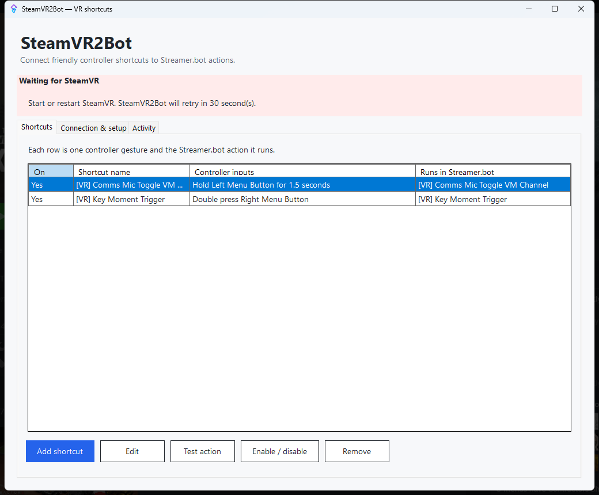
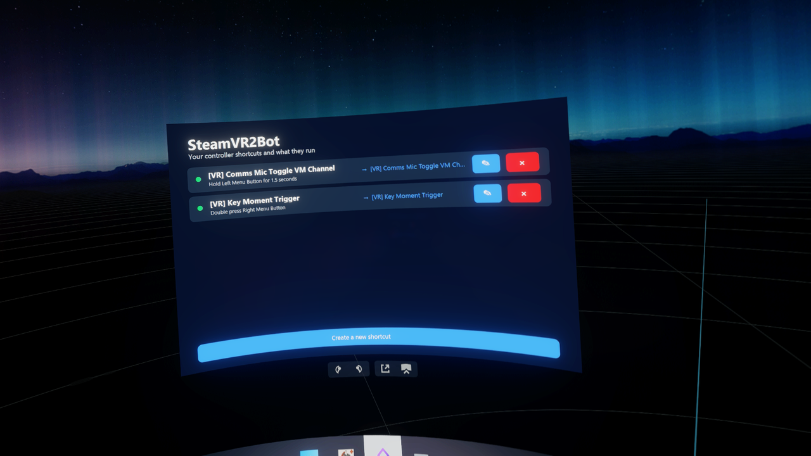
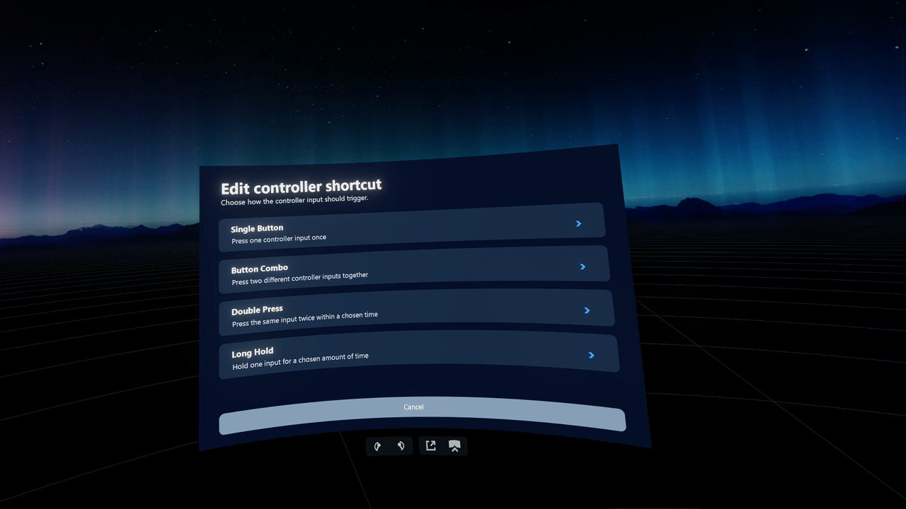
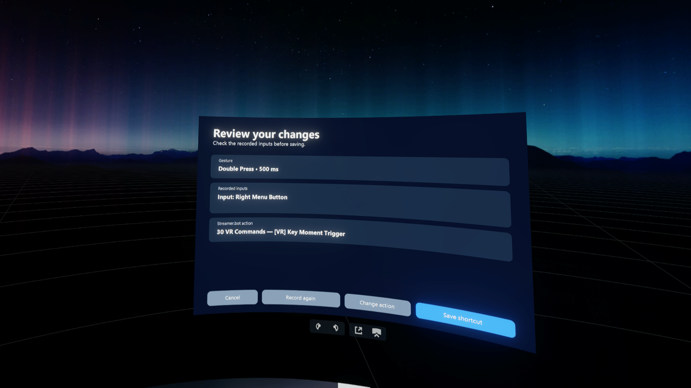
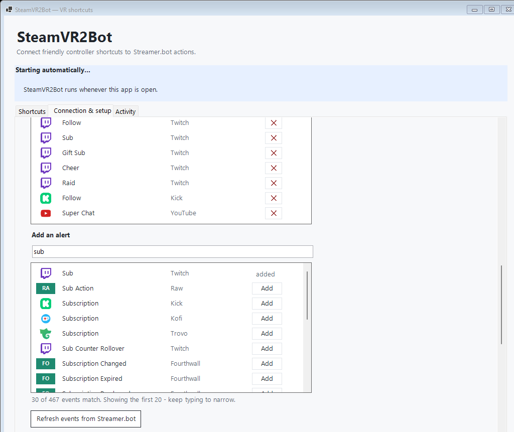
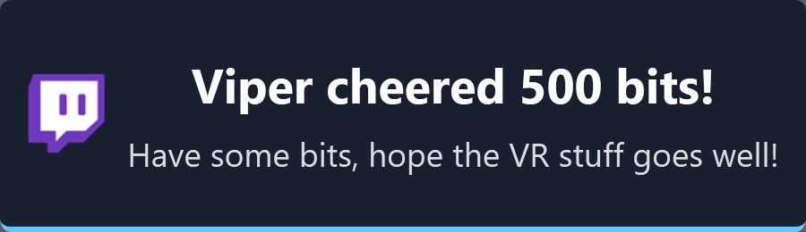
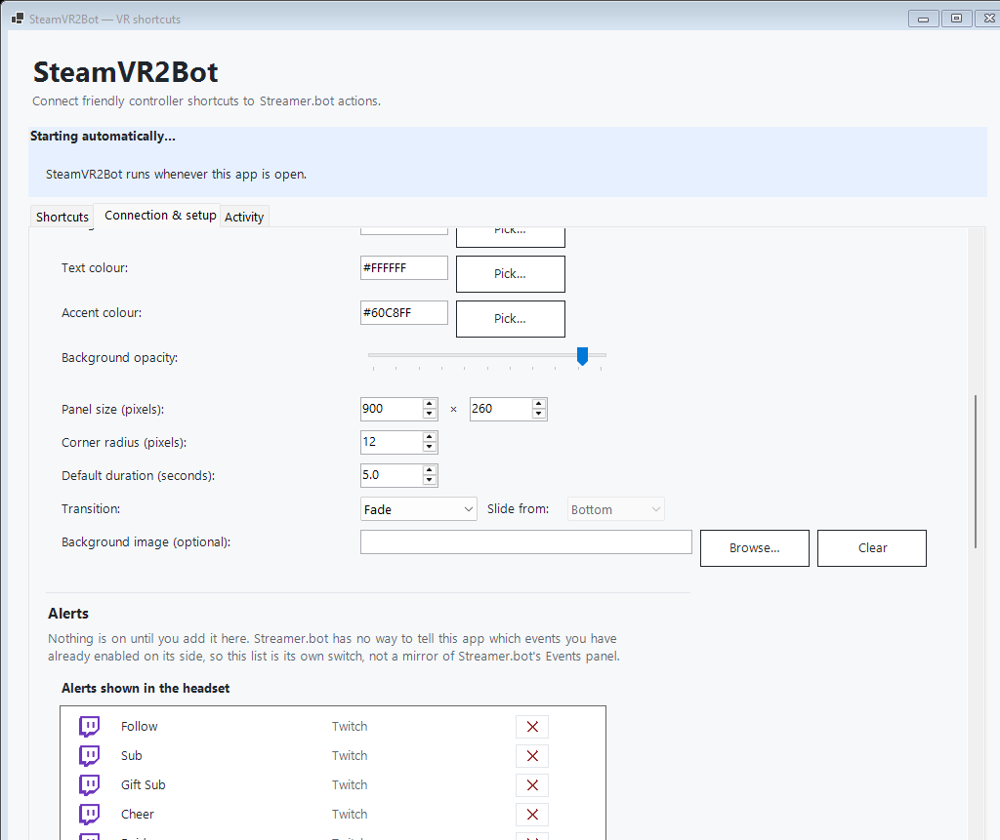

# SteamVR2Bot

SteamVR2Bot runs Streamer.bot actions from safe SteamVR controller shortcuts,
and brings your chat and alerts into the headset. It uses SteamVR actions
directly—there is no keyboard emulation, browser overlay, or OpenVR2Key layer.

The validated Vive shortcut is:

> Hold **Left Grip**, then press **Right Trigger**

The left grip is a safety button, so pulling the trigger by itself does nothing.

Alongside shortcuts, SteamVR2Bot can show:

- **Your Twitch chat** in a window on your wrist, with real emotes and badges,
  grabbable with the laser and placed wherever you want it.
- **Alerts** — follows, subs, cheers, raids, donations — as a panel you
  position by hand, with the platform's icon, its own colours, size and
  animation.

## The desktop window



Every shortcut is one row: the gesture, the controller inputs it listens for,
and the Streamer.bot action it runs. The banner above the tabs reports the
current state — captured here before SteamVR was started.

## Everyday setup

Build the ready-to-run folder:

```powershell
.\scripts\Publish-Poc.ps1
```

This produces `artifacts\publish\` and, alongside it, a versioned zip of that
same folder (`artifacts\SteamVR2Bot-<version>-windows-x64.zip`) — send a
tester either one.

The published app includes its required .NET runtime, so no separate .NET
installation is needed for normal use.

**The deliverable is the whole folder, not just the exe.** Extract the zip
(or copy `artifacts\publish\`) to wherever you want to run it, keeping every
file together, then open `SteamVR2Bot.exe` from inside that folder:

```text
SteamVR2Bot.exe
```

Copying `SteamVR2Bot.exe` out on its own and running it elsewhere will not
work — it needs the rest of the folder beside it, including its native WPF
libraries, to draw chat and notifications. Running it without them crashes
the first time either one is used, with a `DllNotFoundException`.

In the SteamVR2Bot window:

1. Enter the Streamer.bot WebSocket address.
2. Enter the connection password only if Streamer.bot requires one.
3. On **Connection & setup**, choose **Refresh Streamer.bot actions**. That
   page is grouped into Streamer.bot connection, Notifications, Notification
   appearance, Alerts, Chat window, and Controller and SteamVR.
4. On **Shortcuts**, choose **Add shortcut**.
5. Give it a clear name, choose its Streamer.bot action, then choose
   **Record controller inputs**.
6. In VR, release the buttons, hold the safety input, then press the action
   input.
7. Save the shortcut and use **Test action**.

The Shortcuts page lists every gesture and the action it runs. Select a row to
edit, test, enable or disable, or remove it. Existing single-action settings
are migrated automatically as the first shortcut. Every change saves
automatically and is applied to the running bridge.

SteamVR2Bot registers itself with SteamVR and starts automatically whenever the
app is open. There is no separate Save or Start step.

Closing the window keeps SteamVR2Bot running in the Windows notification area.
Use its tray menu to open the app or SteamVR dashboard, test an action, view
logs, or exit.

## SteamVR lifecycle

SteamVR2Bot adds itself to SteamVR's startup list, so SteamVR launches it, and
it closes again when SteamVR shuts down. Nothing is left running in the tray
with no SteamVR to talk to.

Opening SteamVR2Bot from the desktop does not start SteamVR. It waits instead,
retrying after 1, 2, 5, 10, then 30 seconds, so Streamer.bot settings and
shortcuts stay editable without a headset.

Only one copy runs at a time. Launching it again brings the existing window
forward rather than starting a second tray icon, and registration removes any
SteamVR entry left behind by an older install — otherwise SteamVR would launch
a copy from each registered folder.

## In-VR setup

While SteamVR2Bot is open, its tab is always available in the SteamVR dashboard.
Choose the tab in SteamVR, or use **Open SteamVR dashboard** on the Connection &
setup page. It shows the currently saved shortcuts and what each one runs.



To create one without leaving VR:

1. Select **Create a new shortcut**.
2. Choose **Single Button**, **Button Combo**, **Double Press**, or **Long
   Hold**.
3. For Double Press or Long Hold, set the detection tolerance with the slider.
4. Choose the physical input from the grouped Left and Right controller lists.
   A Button Combo selects two different inputs. For live recording, press the
   controller's System button once to close the SteamVR menu, then press the
   desired input. SteamVR2Bot reopens directly on the review page. The lists
   remain available when the menu owns controller focus.
5. Review the exact recorded input names, choose the Streamer.bot action, then
   select **Save shortcut**.





The input picker and review page make the left/right controller and physical
input explicit before anything is saved. The shortcut appears in the desktop
list and becomes active without restarting the SteamVR dashboard.

Each saved row has a pencil button to change its action, input, or gesture, and
an X button to delete it. Both changes save and activate automatically.

## Chat and alerts in the headset

Both surfaces need the Streamer.bot event feed turned on, on **Connection &
setup**. Everything below applies live — no restart, and no Save button.

### Chat on your wrist

Turn on **Show chat messages on your wrist**. Your Twitch and YouTube chat appear in a
window anchored to a controller or to your head, with real emote and badge
images. To move it, point a controller laser at the chat window and drag its
handle — no dashboard mode is needed. SteamVR2Bot turns on overlay interaction
only while that laser is on the chat panel, then releases the controller back
to the game as soon as it leaves. The placement is saved per anchor mode, and
the **Chat** tab has a reset if you put it somewhere unreachable.

**Grow on gaze** is off by default. Turned on, the window grows and brightens
when you look at it.

**Fade in on gaze** is a separate option. It fades chat from transparent to its
configured opacity when you look at it, and can be used on its own if you want
the panel to keep a fixed size.

**Auto-hide away** is on by default. It hides chat if its face is turned away
from you or it has been placed more than about two metres from your head. Turn
it off in the desktop Chat window settings or the VR Chat tab if you want chat
to remain visible regardless of the controller's position.

If the fixed gaze choices do not match where you naturally look, open the VR
dashboard's **Chat** tab and choose **Calibrate gaze fade**. Look directly at
the chat window for three seconds; SteamVR2Bot saves that head-relative point
as the centre of the gaze fade, while the Relaxed, Normal and Tight choices
still set how far away from that calibrated point the window fades. Re-run the
calibration after moving the chat window or changing its anchor. Starting
calibration turns on **Grow on gaze** so the result is immediately visible.

> Chat needs at least one enabled trigger in Streamer.bot bound to
> `Twitch > Chat Message`, even though SteamVR2Bot subscribes to the event
> directly. See [Known limitations](#known-limitations).

### Alerts

**Nothing is enabled until you add it.** Streamer.bot has no way to tell this
app which events you have already enabled on its side, so this list is its own
switch rather than a mirror of Streamer.bot's Events panel — and upgrading
never starts sending you alerts you did not choose.

A connected Streamer.bot instance reports around 470 events across 44 sources,
so the picker shows what you have enabled first and treats adding one as a
search rather than a browse:



- Search by platform or by what happens — `follow`, `sub`, `bits`, `raid`.
  Plurals work, and so do the words you would actually say: `bits` finds
  Twitch's `Cheer`, `member` finds YouTube's `Sponsor`.
- Results are ranked, so the obvious answer is first rather than buried among
  incidental matches.
- Every source gets an icon where one ships, and a coloured chip with its
  initials where one does not — including a platform added to Streamer.bot
  after this app was built.

### What an alert says

By default an alert uses the platform's own wording when it sends any. Twitch
writes a whole sentence for subs and gift subs, and that is used verbatim.
Otherwise the alert names whoever it is about and what happened, and a cheer's
or donation's message appears underneath on its own line.



Text is centred and scales to fill the panel, so a short alert is not lost in a
large box and a long message shrinks to fit rather than being cut off:


To word one yourself, use **Customise wording for:** → **Edit template…**:

```text
{user.name} subscribed for {duration_months} months at tier {sub_tier}!
```

`{dotted.path}` reads a field from the event's own data. List alternatives with
`|` and the first present one wins, ending in a `"quoted"` literal as a last
resort — which is how one template covers events that name their subject
differently:

```text
{user.name|targetUser.name|"Someone"} — {eventName}
```

`{eventName}` is the event's readable name ("Gift Sub"), `{eventSource}` its
source, `{event}` both.

To find an event's real field names, either read them from
[docs.streamer.bot](https://docs.streamer.bot/api/websocket/events), or turn
the event on and let it happen once — every event that arrives records its whole
payload in the activity log as `streamerbot.event_payload`.

To test without waiting for a real viewer, use the tray menu's **Notification
test harness (developer)**, which fires whatever you have enabled through the
same path a real event takes.

### Appearance



Background, text and accent colours, background opacity, panel size in pixels,
corner radius, default duration, and a Fade, Slide or Scale pop transition. An
optional PNG is drawn behind the text, letterboxed rather than stretched or
cropped; when one is set, nothing is added over it uninvited.

A payload's own `accent`, `duration` and `image` still win over these defaults
for that one alert.

Panel size is the texture's resolution and aspect ratio — how much text fits
and what shape the panel is. Its physical size in the headset is the **Size**
slider under Notifications.

### Positioning

The VR dashboard has a tab per surface — **Shortcuts**, **Chat**,
**Notifications**. Select the anchor you want first, then choose **Place
notifications**. It pins a permanent dummy frame you can grab with the laser
and place exactly where you want alerts to appear. Close the SteamVR dashboard
without changing SteamVR2Bot tabs, point at the frame, hold the trigger while
moving it, then release to save. The button becomes **Finish placing**; use it
only to dismiss the frame after you are done. Leaving the tab or restarting
also keeps the placement, and a reset button puts it back.

## Controller inputs

The VR picker presents controller-aware physical input names, such as **Left
Menu Button**, **Left Grip**, and **Right Trigger**. This avoids SteamVR's
dashboard consuming a button while the wizard is trying to observe it. SteamVR
reserves raw controller input while its system dashboard has focus, so live
recording briefly yields that focus and returns to the wizard automatically.

The picker's offered inputs are controller-family-aware and hand-aware:

| Family | Left hand | Right hand |
|---|---|---|
| Vive wand | Menu, Grip, Trigger, Trackpad | Menu, Grip, Trigger, Trackpad |
| Valve Index | Grip, Trigger, Thumbstick, A, B | Grip, Trigger, Thumbstick, A, B |
| Quest / Touch | Menu, Grip, Trigger, Thumbstick, X, Y | Grip, Trigger, Thumbstick, A, B |
| Anything else | Grip, Trigger, stick/trackpad | Grip, Trigger, stick/trackpad |

Index has no application-menu input in this picker — real Index (Knuckles)
hardware exposes no such input at all. Touch exposes its menu button only on
the left controller; the same position on the right controller is the
Oculus/system button, which SteamVR reserves for itself and never hands to an
application. An unrecognised controller type gets only the conservative
grip/trigger/stick set, since a face-button pair or a menu button is not safe
to assume for hardware this app has never seen.

**Only the Vive preset is hardware-validated.** SteamVR2Bot installs its
complete Vive input map automatically and keeps re-installing it on every
launch, so a Vive shortcut needs no separate visit to SteamVR Controller
Bindings, and its inputs are not something a workshop binding or a stray
click can silently break.

Index and Quest/Touch now have **provided** default input maps too —
`bindings_index_controller.json` and `bindings_oculus_touch.json` — installed
automatically through SteamVR's own `default_bindings` mechanism the first
time SteamVR sees that controller type with no binding of its own yet. They
were built from SteamVR's own shipped input-profile and dashboard-binding
files for each controller, not guessed, but **neither has been confirmed on
real hardware.** Unlike Vive, they are not forced back into place on every
launch — see [SteamVR binding](#steamvr-binding) below for why that matters.
Verify the recorded names and run the live test matrix (`LIVE_TEST_RESULTS.md`)
before treating either as validated. For WMR, Cosmos, or any other controller,
the picker falls back to the conservative grip/trigger/stick set above; verify
recorded names the same way before relying on it.

The provided Index map treats the grip's force input as pressed at **0.80**
and released at **0.65**. The provided Touch map treats each analog grip as
pressed at **0.65** and released at **0.50**. Those lower release values add
hysteresis so a deliberate squeeze remains stable as the hand relaxes, while
the higher activation values are intended to avoid firing from merely resting
a hand on the controller. Touch triggers use SteamVR's shipped dashboard
thresholds (**0.65** press, **0.60** release); Index uses the controller's
genuine trigger click output. These choices are schema-checked but still need
the grip-rest, squeeze, release and chatter rows in the hardware matrix before
their feel can be called validated.

The original SteamVR logical-input route remains available as a compatibility
fallback:

- **Safety Button** — held to prevent an accidental command.
- **Action Button** — pressed to run the selected Streamer.bot action.

Choose **SteamVR input bindings** to open the official binding page directly.
SteamVR keeps a separate binding for each controller family, so changing an
Index binding does not overwrite a Vive or Touch binding.

The packaged Vive preset—Left Grip plus Right Trigger—is live-validated. Index
and Quest/Touch are detected and now ship with a provided default preset each,
but neither is labelled as validated until the live hardware matrix passes.

Each shortcut's gesture behavior supports:

- Press one chosen input once.
- Press two chosen inputs together within 300 ms.
- Double press one chosen input with an adjustable 200–1200 ms tolerance.
- Hold one chosen input for an adjustable 0.5–5 seconds.
- Hold the Safety Button, then press the Action Button.

## Streamer.bot address

When Streamer.bot is on the same PC, the usual address is:

```text
ws://127.0.0.1:8080/1
```

When it is on the streaming PC, use that PC's private-network address, for
example:

```text
ws://192.168.1.50:8080/1
```

Streamer.bot's WebSocket server must allow LAN connections, and its port must be
allowed through Windows Firewall on the private network.

SteamVR2Bot displays action names but stores the action's stable ID after it is
selected. Renaming an action in Streamer.bot therefore does not silently point
the shortcut at a different action.

## Password safety

The Streamer.bot password is saved in:

```text
%LOCALAPPDATA%\SteamVR2Bot\settings.json
```

Windows protects it for the current Windows user. It is not stored as readable
text and is never written to the activity log. On first launch, SteamVR2Bot can
import the old gitignored `appsettings.json` and immediately protect its
password.

## SteamVR binding

SteamVR setup is registered automatically when the app opens. Use **Repair
SteamVR setup** only if the dashboard entry or controller binding was removed.
The packaged Vive binding uses:

- **Safety button:** Left Grip
- **Action button:** Right Trigger

Every family's default gesture is the same — hold Left Grip, then press Right
Trigger — but Vive, Index, and Quest/Touch get there differently, and the
difference is intentional:

- **Vive's binding is force-reinstalled on every launch.** SteamVR2Bot
  actively re-selects the packaged Vive map every time it starts, so a Vive
  binding can never silently drift from the validated preset — but it also
  means an edit made through SteamVR's own Controller Bindings page does not
  survive a restart. This is existing, unchanged behaviour.
- **Index and Quest/Touch are installed only once, through SteamVR's own
  `default_bindings` mechanism** — the first time SteamVR sees that
  controller type with no binding of its own for this app yet. After that,
  SteamVR2Bot never touches the binding again. A binding you customise
  through SteamVR's Controller Bindings page for Index or Touch survives
  every future launch, unlike Vive's.

To change any binding, open SteamVR Controller Bindings and select
**SteamVR2Bot**. Its logical controls are:

- **Safety Button (hold)**
- **Action Button (press)**

The bridge has passed 20/20 attempts in the SteamVR shell through both the
diagnostic and tray hosts. With GERONIMO active and the dashboard closed, it
passed 20/20 through the diagnostic host and 21/21 through the tray host. That
result covers the Vive preset only. See `LIVE_TEST_RESULTS.md` for the
evidence, and for the Index/Quest hardware matrix, recorded as not yet run.

## Status messages

- **Stopped** — the controller shortcut is not running.
- **Starting…** — SteamVR2Bot is connecting to SteamVR.
- **Ready for your shortcut** — controller input is active.
- **Running your action…** — the shortcut was detected.
- **Needs attention** — the status detail explains what to check.

Recent activity shows input and delivery events without exposing credentials.

The same events are written as structured JSON lines under:

```text
%LOCALAPPDATA%\SteamVR2Bot\Logs
```

Use **Open logs** in the app or tray menu. Logs are kept for 14 days.

### What the logs do and do not keep

Kept for 14 days:

- What SteamVR2Bot did — controller input edges, gesture detection, dashboard
  state, worker restarts, and Streamer.bot delivery and acknowledgement.
- For the Streamer.bot event feed, only that a payload arrived, what kind it was
  (chat, notification, or control), and how many have arrived this session.

Never written to disk:

- The Streamer.bot password, which Windows protects for your user account.
- **Chat message text, viewer names, and anything else a viewer wrote.** Those
  are held in memory only, for as long as it takes to draw them in VR. Chat is
  other people's words, and SteamVR2Bot does not archive them on your machine.

So the logs can tell you the event feed is alive, connected, and delivering — but
they cannot tell you what anyone said. If you need to see message contents while
setting up the Streamer.bot side, run the console diagnostic host, which prints
them without retaining them.

## Restart and network recovery

- SteamVR input runs in a small disposable worker. If that worker stops
  unexpectedly, the tray app remains open and creates a new one after 1, 2, 5,
  10, then 30 seconds. A deliberate SteamVR shutdown is told apart from a lost
  worker, and closes SteamVR2Bot instead of starting that retry cycle.
- If Streamer.bot is unavailable before delivery, the bridge makes three
  bounded connection attempts. The next controller shortcut tries again.
- If the connection is lost after delivery begins, the action is not blindly
  resent. The status says that confirmation was lost; avoiding a possible
  duplicate takes priority.

## Known limitations

- **Some games hide every SteamVR overlay, including chat and
  notifications.** Games that bypass the SteamVR compositor and draw directly
  to the headset make every overlay invisible in those games - the dashboard,
  chat, and notifications alike. This is a property of the platform, not a
  bug in SteamVR2Bot. If overlays appear in the SteamVR display mirror but not
  in the headset, that is what is happening.
- **Twitch chat requires at least one enabled trigger in Streamer.bot bound to
  `Twitch > Chat Message`, even though SteamVR2Bot subscribes to that event
  directly and needs no relay action of its own.** Streamer.bot's own chat
  pipeline only appears to forward `Twitch.ChatMessage` over its WebSocket API
  while a local trigger of that type exists somewhere in its Action system -
  confirmed by watching SteamVR2Bot's own logs stop receiving anything the
  moment the last such trigger was removed, and resume the moment one was
  added back, with no change on SteamVR2Bot's side either time. Streamer.bot's
  WebSocket API has no request that lets an external app create a trigger
  remotely, so this cannot be worked around here - the trigger does not need
  to do anything (no sub-actions, no code), it just needs to exist and be
  enabled.
- **The SteamVR dashboard panel can briefly blink when it redraws, most
  noticeably under rapid interaction** - for example clicking quickly several
  times along a slider. It is not the app running slowly: each individual
  update measures 15-32 ms, well within a single frame, and the blink
  reproduces identically on the shortcut wizard's Tolerance slider, which has
  been unchanged since the very first release. Ordinary, unhurried interaction
  rarely triggers it noticeably.

  **The chat window, notifications and the test overlay can stop blinking**
  by uploading through a persistent Direct3D 11 texture (`SetOverlayTexture`),
  which SteamVR writes in place, rather than a CPU buffer it reallocates on
  every write - that reallocation is what shows through as a blink.
  Live-confirmed working, but off by default: this is the first native GPU
  dependency in this app, untested across the range of GPUs and drivers real
  users run. Turn it on from the tray's "Chat test harness" submenu (**Chat &
  notification overlays via SetOverlayTexture (developer)**) to try it; it is
  never persisted, so it is off again at the next launch.

  **The dashboard cannot currently use that path.** A SteamVR *dashboard*
  overlay accepts the GPU-texture call, reports success, and then never
  displays the result - the panel simply freezes on whatever it last showed.
  Every ordinary overlay works; only the dashboard behaves this way. So the
  dashboard stays on the CPU path, where it blinks but is correct. This is a
  SteamVR behaviour rather than something fixable here, and it is the last
  surface still affected.

## Diagnostics

The console diagnostic remains available at:

```text
artifacts\publish\diagnostics\SteamVR2Bot.Diagnostics.exe
```

Useful checks:

```powershell
.\artifacts\publish\diagnostics\SteamVR2Bot.Diagnostics.exe --self-test
.\artifacts\publish\diagnostics\SteamVR2Bot.Diagnostics.exe --simulate
.\artifacts\publish\diagnostics\SteamVR2Bot.Diagnostics.exe --inspect-bindings
.\artifacts\publish\diagnostics\SteamVR2Bot.Diagnostics.exe --open-bindings
.\scripts\Register-SteamVrApp.ps1
```

The normal daily-use path is the tray app; the console is retained for
troubleshooting and regression testing.
