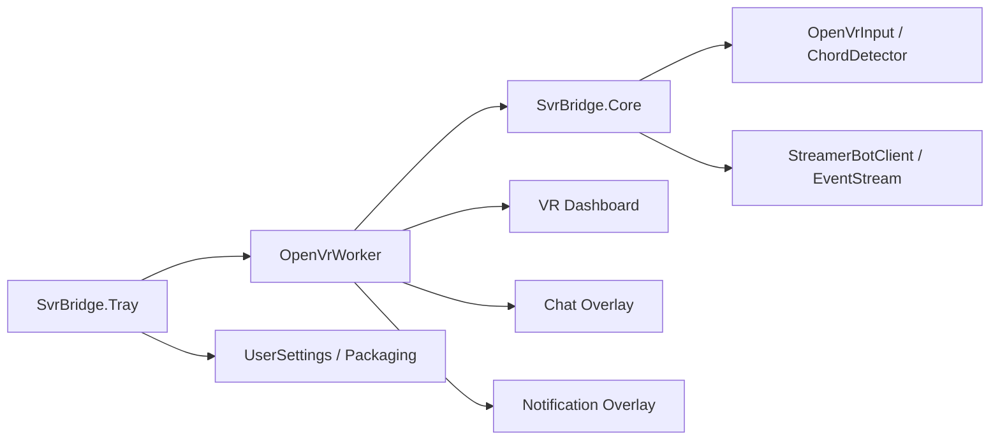

# Project map

This is a navigation map, not a complete symbol index. Start with the node
matching the task, then follow only the direct edges and listed files.

## Areas

| Area | Responsibility | Start with | Evidence or tests |
|---|---|---|---|
| input | physical input, gestures, delivery | `src/SvrBridge.Core/OpenVrInput.cs`, `ChordDetector.cs`, `BridgeEngine.cs`, `src/SvrBridge.Tray/OpenVrWorker.cs` | `GESTURE_TRIGGERS.md`, `FOCUSED_INPUT_PROBE.md`, self-tests |
| dashboard | wizard pages, pointer input, repainting | `VrDashboardController.cs`, `VrDashboardRenderer.cs`, `VrDashboardLayout.cs`, `VrActionBrowser.cs` | `HANDOFF.md`, dashboard sections of `LIVE_TEST_RESULTS.md` |
| chat | chat data, rendering, emotes, laser placement | `ChatOverlay.cs`, `ChatOverlayInput.cs`, `ChatRingBuffer.cs`, `WpfChatRenderer.cs` | `CHAT_AND_NOTIFICATIONS_PLAN.md`, `HANDOFF.md` |
| notifications | event catalog, templates, rendering, playback | `NotificationOverlay.cs`, `NotificationEventPicker.cs`, `WpfNotificationRenderer.cs`, `StreamerBotEventCatalog.cs` | `PHASE7_HANDOFF.md`, `PHASE7_NOTIFICATION_CUSTOMISATION_PROMPT.md` |
| settings | persistence, live overrides, anchors | `UserSettings.cs`, `AppConfig.cs`, `VrSettingsSnapshot.cs`, `SurfaceOverrideState.cs` | `NEXT_PHASE_PLAN.md`, settings sections of `README.md` |
| packaging | SteamVR registration, assets, publishing | `SteamVrApplications.cs`, `SidecarAssets.cs`, `scripts/Register-SteamVrApp.ps1`, `scripts/Publish-Poc.ps1` | `README.md`, validation/operations guidance |
| general | shared core and diagnostics | `src/SvrBridge.Core/`, `src/SvrBridge/`, project files | targeted self-tests and build |

## Edges and invariants

- `SvrBridge.Tray` references `SvrBridge.Core`; the diagnostic project also
  references `SvrBridge.Core`.
- `OpenVrWorker` owns the OpenVR session and its thread. Do not move OpenVR
  calls into UI callbacks or background helpers without a deliberate design.
- `BridgeEngine.UpdateShortcuts` applies shortcut changes without restarting
  the worker.
- `StreamerBotClient` must preserve one-request/one-acknowledgement semantics;
  uncertain delivery must not be blindly resent.
- `MotionSample` is a gesture body frame. Use `OpenVrInput.TryGetDevicePose`
  for true device rotation or eye-line needs.
- Persisted `ChordMode` numeric ordering is compatibility-sensitive.

## Exclusions during orientation

Do not inspect `artifacts/`, `bin/`, `obj/`, `VR UI Screenshots/`, generated
packages, or full historical logs unless the task explicitly concerns them.
